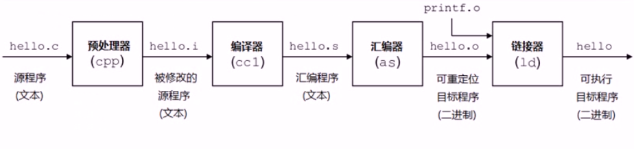

### gcc编译过程:

- 预处理（Pre-Processing）编译 （Compiling）
- 汇编 （Assembling）链接 （Linking）

#

```
gcc -E hello.c -o hello.i   对hello.c文件进行预处理，生成了hello.i 文件
gcc -S hello.i -o hello.s    对预处理文件进行编译，生成了汇编文件 
gcc -c hello.s -o hello.o  对汇编文件进行编译，生成了目标文件
gcc hello.o -o hello 对目标文件进行链接，生成可执行文件
gcc hello.c -o hello 直接编译链接成可执行目标文件
gcc -c hello.c 或 gcc -c hello.c -o hello.o 编译生成可重定位目标文件 
-o	目标文件命名
-c	通知gcc取消连接步骤，即编译源码，并在最后生成目标文件
-Wall	使gcc对源文件的代码有问题的地方发出警告
-Idir	将dir目录加入搜索头文件的目录路径:-I/usr/local/include
-Ldir	将dir目录加入搜索库的目录路径:-L/usr/local/lib


$ gcc -Wall -I/usr/local/include -c example.c
$ gcc -L/usr/local/lib example.o -lgsl -lm
$ gcc hypergeometric2F1.c -lgsl -lgslcblas -lm -o hypergeometric2F1

```


